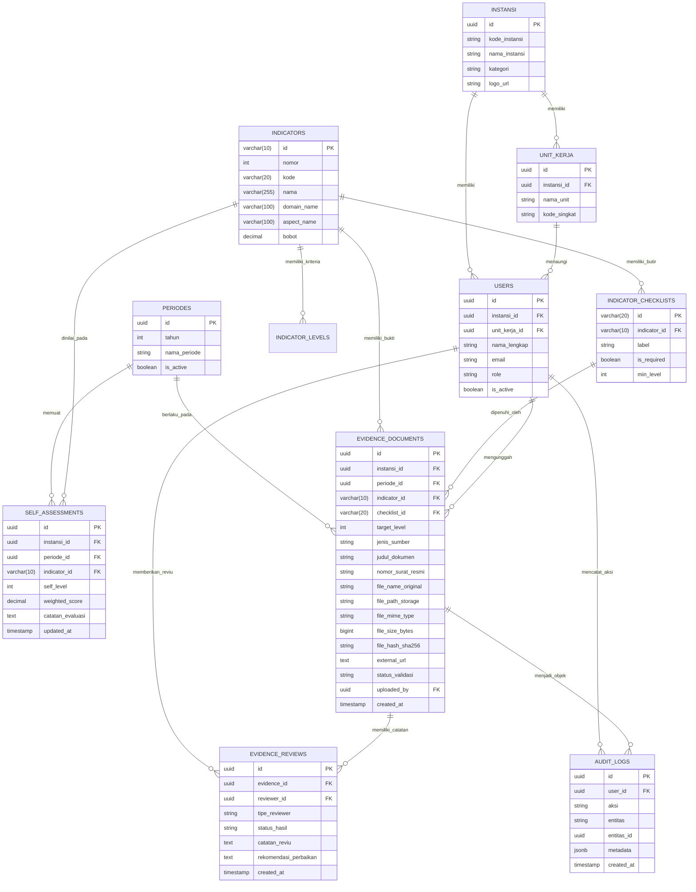

# Rencana & Realisasi Implementasi Basis Data: Pengelolaan & Unggah Bukti Dukung Indikator
## Aplikasi Evaluasi Kinerja Pemerintahan Digital (PermenPANRB No. 8 Tahun 2026)
**Dokumen Referensi Teknis**: `database1.md`  
**Target RDBMS**: **MySQL 8.4 LTS (InnoDB)**  
**Nama Database**: `EvalPemdi` (User: `root`, Password: blank)  
**Status Eksekusi**:  **BERHASIL DIEKSEKUSI & DI-SEED (11 Tabel + Master Data 20 Indikator)**  
**Tanggal Eksekusi**: September 2026  

---

> [!NOTE]
> **Status Eksekusi Database**:  
> Seluruh skema tabel telah **berhasil dibuat dan diuji secara langsung** pada server MySQL lokal (Laragon MySQL 8.4.3) di database `EvalPemdi`.  
> File skrip mandiri tersedia di:
> - DDL Schema: [`schema_mysql.sql`](file:///d:/DODI%20AGUSRI.S.KOM/2026%202026%202026/FELLOW%20DEVELOPER/React.JS/EVAL_PEMDI/schema_mysql.sql)
> - Data Seeding: [`seed_data.sql`](file:///d:/DODI%20AGUSRI.S.KOM/2026%202026%202026/FELLOW%20DEVELOPER/React.JS/EVAL_PEMDI/seed_data.sql)

---

## 1. Latar Belakang & Kebutuhan Sistem

Pada versi awal aplikasi **EVAL-PEMDI**, data checklist dan tautan bukti dukung disimpan secara lokal di browser (*LocalStorage*). Untuk mendukung kebutuhan kolaborasi antar Organisasi Perangkat Daerah (OPD) / unit kerja di lingkungan instansi pemerintah, diperlukan integrasi basis data (*database*) terpusat yang mampu:
1. **Mengelola Unggah Berkas Bukti Dukung**: Pengguna dapat mengunggah berbagai format dokumen fisik/digital (PDF, DOCX, XLSX, PNG, JPG) atau menyematkan tautan (*Google Drive*, Cloud Storage instansi, portal aplikasi).
2. **Keterkaitan Multi-Level**: Setiap bukti dukung terhubung secara eksplisit dengan:
   - **Indikator** (Indikator 01 s.d. 20 PermenPANRB No. 8/2026).
   - **Target Level Kematangan** (Level 1 s.d. Level 5).
   - **Butir Checklist Dokumen Wajib / Rekomendasi** (misal: SK Tim, SOP, Laporan Audit, dsb.).
3. **Multi-User & Multi-Instansi (OPD PIC)**: Pembagian hak akses pengunggahan berkas bukti berdasarkan unit kerja pengampu indikator (misal: Diskominfo untuk Arsitektur & Keamanan, BKPSDM untuk SDM Digital, Bappeda untuk Perencanaan Anggaran).
4. **Verifikasi & Validasi Asesor**: Penilaian kelayakan bukti oleh Asesor Internal sebelum evaluasi resmi KemenPANRB, dilengkapi catatan rekomendasi perbaikan dan riwayat penilaian AI.

> [!IMPORTANT]
> **Arsitektur Penyimpanan Berkas (*Best Practice*)**:  
> Berkas biner (Binary Large Object / BLOB) fisik berukuran megabyte **TIDAK DISIMPAN** langsung di dalam kolom tabel SQL (karena dapat menyebabkan fragmentasi, lambatnya backup, dan pembengkakan memori database).  
> **Standar Arsitektur**: Berkas biner disimpan pada **Object Storage / Local Uploads Directory** (misal: `uploads/{instansi}/{tahun}/{indicator_id}/`), sedangkan tabel `evidence_documents` di MySQL menyimpan **metadata dokumen lengkap** (lokasi path, nama asli, ukuran, hash checksum sha256, mime type, status validasi, level target, dan relasi entitas).

---

## 2. Diagram Hubungan Entitas (Entity-Relationship Diagram / ERD)

Berikut adalah relasi antar tabel dalam sistem pengelolaan bukti dukung:



---

## 3. Kamus Data & Spesifikasi Detail Tabel

### 3.1. Tabel Master & Organisasi

#### A. Tabel `instansi`
Menyimpan profil pemerintah daerah atau kementerian/lembaga pengguna sistem.
| Kolom | Tipe Data | Keterangan / Konstrain |
| :--- | :--- | :--- |
| `id` | `UUID` | Primary Key, `DEFAULT gen_random_uuid()` |
| `kode_instansi` | `VARCHAR(50)` | UNIQUE, NOT NULL (Kode Kemendagri / BKN) |
| `nama_instansi` | `VARCHAR(255)` | NOT NULL (Contoh: "Pemerintah Kabupaten X") |
| `kategori` | `VARCHAR(50)` | Kementerian / Lembaga / Pemprov / Pemkab / Pemkot |
| `alamat_kantor` | `TEXT` | Alamat resmi instansi |
| `logo_url` | `TEXT` | URL lambang daerah / logo |
| `created_at` | `TIMESTAMPTZ` | DEFAULT `NOW()` |
| `updated_at` | `TIMESTAMPTZ` | DEFAULT `NOW()` |

#### B. Tabel `unit_kerja` (OPD)
Menyimpan data dinas/badan/bagian di lingkup instansi sebagai penanggung jawab indikator (PIC).
| Kolom | Tipe Data | Keterangan / Konstrain |
| :--- | :--- | :--- |
| `id` | `UUID` | Primary Key |
| `instansi_id` | `UUID` | Foreign Key -> `instansi(id)` ON DELETE CASCADE |
| `nama_unit` | `VARCHAR(255)` | NOT NULL (Contoh: "Dinas Komunikasi dan Informatika") |
| `singkatan` | `VARCHAR(50)` | DISKOMINFO, BAPPEDA, BKPSDM, dll. |
| `created_at` | `TIMESTAMPTZ` | DEFAULT `NOW()` |

#### C. Tabel `users`
Pengguna sistem yang melakukan unggah, verifikasi, atau monitoring.
| Kolom | Tipe Data | Keterangan / Konstrain |
| :--- | :--- | :--- |
| `id` | `UUID` | Primary Key |
| `instansi_id` | `UUID` | Foreign Key -> `instansi(id)` |
| `unit_kerja_id` | `UUID` | Foreign Key -> `unit_kerja(id)`, NULLable |
| `nama_lengkap` | `VARCHAR(150)` | NOT NULL |
| `email` | `VARCHAR(150)` | UNIQUE, NOT NULL |
| `password_hash` | `TEXT` | NOT NULL (Bcrypt / Argon2, atau dikelola Supabase Auth) |
| `role` | `VARCHAR(50)` | `admin_instansi`, `pic_opd`, `asesor_internal`, `viewer` |
| `telepon_wa` | `VARCHAR(30)` | Nomor kontak penanggung jawab |
| `is_active` | `BOOLEAN` | DEFAULT `TRUE` |
| `created_at` | `TIMESTAMPTZ` | DEFAULT `NOW()` |

---

### 3.2. Tabel Regulasi & Indikator (PermenPANRB No. 8/2026)

#### D. Tabel `indicators`
Katalog 20 Indikator Evaluasi Kinerja Pemerintah Digital.
| Kolom | Tipe Data | Keterangan / Konstrain |
| :--- | :--- | :--- |
| `id` | `VARCHAR(10)` | Primary Key (Contoh: `'ind-01'`, `'ind-02'`) |
| `nomor` | `INT` | 1 s.d. 20 |
| `kode` | `VARCHAR(20)` | `'IND-01'`, `'IND-02'`, dst. |
| `nama` | `VARCHAR(255)` | Nama resmi indikator |
| `domain_id` | `VARCHAR(20)` | `'aspek-1'`, `'aspek-2'`, dst. |
| `domain_name` | `VARCHAR(100)` | Tata Kelola, Layanan, dll. |
| `aspect_name` | `VARCHAR(100)` | Sub-aspek regulasi |
| `bobot` | `DECIMAL(5,2)` | Bobot persentase evaluasi (default 5.00) |
| `deskripsi` | `TEXT` | Deskripsi umum indikator |
| `tips_asesor` | `TEXT` | Tips persiapan data dukung |

#### E. Tabel `indicator_levels`
Kriteria level kematangan 1 s.d. 5 beserta panduan bukti naratif per level.
| Kolom | Tipe Data | Keterangan / Konstrain |
| :--- | :--- | :--- |
| `id` | `UUID` | Primary Key |
| `indicator_id` | `VARCHAR(10)` | Foreign Key -> `indicators(id)` |
| `level` | `INT` | 1 (Rintisan) s.d. 5 (Optimum) |
| `kriteria` | `TEXT` | Kriteria normatif permenpan |
| `narasi_bukti` | `TEXT` | Rincian berkas bukti yang wajib ada pada level ini |

#### F. Tabel `indicator_checklists`
Daftar checklist bukti pendukung spesifik (menggantikan array statis di frontend).
| Kolom | Tipe Data | Keterangan / Konstrain |
| :--- | :--- | :--- |
| `id` | `VARCHAR(30)` | Primary Key (Contoh: `'c1-1'`, `'c3-2'`) |
| `indicator_id` | `VARCHAR(10)` | Foreign Key -> `indicators(id)` |
| `label` | `TEXT` | Nama dokumen bukti |
| `is_required` | `BOOLEAN` | DEFAULT `TRUE` |
| `min_level` | `INT` | Target level minimal (misal: 3 atau 4) |
| `urutan` | `INT` | Urutan penomoran tampilan |

---

### 3.3. Tabel Transaksi Evaluasi & Unggahan Bukti Dukung (Core Module)

#### G. Tabel `evaluation_periods`
Mendukung multi-tahun evaluasi (misal: Tahun 2026, Tahun 2027).
| Kolom | Tipe Data | Keterangan / Konstrain |
| :--- | :--- | :--- |
| `id` | `UUID` | Primary Key |
| `tahun` | `INT` | NOT NULL (2026) |
| `nama_periode` | `VARCHAR(100)` | "Evaluasi Mandiri Pemdi 2026" |
| `tanggal_mulai` | `DATE` | Awal pengisian bukti |
| `tanggal_selesai` | `DATE` | Batas akhir pengunggahan bukti |
| `is_active` | `BOOLEAN` | DEFAULT `TRUE` |

#### H. Tabel `self_assessments`
Menyimpan capaian target level dan progres mandiri per indikator bagi tiap instansi.
| Kolom | Tipe Data | Keterangan / Konstrain |
| :--- | :--- | :--- |
| `id` | `UUID` | Primary Key |
| `instansi_id` | `UUID` | Foreign Key -> `instansi(id)` |
| `periode_id` | `UUID` | Foreign Key -> `evaluation_periods(id)` |
| `indicator_id` | `VARCHAR(10)` | Foreign Key -> `indicators(id)` |
| `self_level` | `INT` | Level klaim mandiri (1 s.d. 5) |
| `weighted_score` | `DECIMAL(6,3)` | Nilai bobot = (self_level * bobot) |
| `catatan_internal` | `TEXT` | Catatan kendala / keterangan OPD |
| `status_kesiapan` | `VARCHAR(50)` | `belum_lengkap`, `sebagian`, `siap_evaluasi` |
| `updated_by` | `UUID` | Foreign Key -> `users(id)` |
| `updated_at` | `TIMESTAMPTZ` | DEFAULT `NOW()` |

#### I. Tabel `evidence_documents` (**Tabel Utama Unggahan Berkas**)
Menampung seluruh berkas digital dan tautan cloud bukti dukung yang diunggah oleh user.
| Kolom | Tipe Data | Keterangan / Konstrain |
| :--- | :--- | :--- |
| `id` | `UUID` | Primary Key, `DEFAULT gen_random_uuid()` |
| `instansi_id` | `UUID` | NOT NULL, FK -> `instansi(id)` |
| `periode_id` | `UUID` | NOT NULL, FK -> `evaluation_periods(id)` |
| `indicator_id` | `VARCHAR(10)` | NOT NULL, FK -> `indicators(id)` |
| `checklist_id` | `VARCHAR(30)` | NULLable, FK -> `indicator_checklists(id)` |
| `target_level` | `INT` | Level yang dibuktikan (1 s.d. 5) |
| `jenis_sumber` | `VARCHAR(30)` | `file_upload`, `cloud_link`, `screenshot` |
| `judul_dokumen` | `VARCHAR(255)` | NOT NULL (Contoh: "Perbup No. 24 Th 2025 ttg Arsitektur SPBE") |
| `nomor_surat_resmi` | `VARCHAR(100)` | Nomor surat / Keputusan Pimpinan jika ada |
| `tahun_terbit` | `INT` | Tahun dokumen dibuat |
| `deskripsi_singkat` | `TEXT` | Ringkasan isi berkas untuk asisten AI |
| `file_name_original` | `VARCHAR(255)` | Nama asli berkas (misal: `SK_Tim_2026.pdf`) |
| `file_name_system` | `VARCHAR(255)` | Nama unik di storage (`ind01_c1_uuid.pdf`) |
| `file_path_storage` | `TEXT` | Path lengkap di Bucket Storage |
| `file_mime_type` | `VARCHAR(100)` | `application/pdf`, `image/png`, dll. |
| `file_size_bytes` | `BIGINT` | Ukuran berkas dalam bytes |
| `file_hash_sha256` | `VARCHAR(64)` | Checksum integritas berkas |
| `external_url` | `TEXT` | Tautan jika jenis_sumber = `cloud_link` (G-Drive / OneDrive) |
| `status_validasi` | `VARCHAR(30)` | `draft`, `diajukan`, `memenuhi`, `perlu_revisi`, `ditolak` |
| `uploaded_by` | `UUID` | NOT NULL, FK -> `users(id)` |
| `created_at` | `TIMESTAMPTZ` | DEFAULT `NOW()` |
| `updated_at` | `TIMESTAMPTZ` | DEFAULT `NOW()` |

#### J. Tabel `evidence_reviews` (Catatan Asesor & AI Gemini)
Menyimpan riwayat analisis kelayakan bukti dukung, baik oleh asesor manusia maupun Google Gemini AI.
| Kolom | Tipe Data | Keterangan / Konstrain |
| :--- | :--- | :--- |
| `id` | `UUID` | Primary Key |
| `evidence_id` | `UUID` | NOT NULL, FK -> `evidence_documents(id)` ON DELETE CASCADE |
| `reviewer_id` | `UUID` | NULLable jika AI, FK -> `users(id)` jika asesor manusia |
| `tipe_reviewer` | `VARCHAR(30)` | `asesor_manusia` atau `gemini_ai` |
| `status_hasil` | `VARCHAR(30)` | `layak`, `kurang_lengkap`, `tidak_sesuai` |
| `skor_relevansi` | `INT` | Skala 1 - 100 (khusus analisis AI) |
| `catatan_reviu` | `TEXT` | Komentar / temuan kekurangan bukti |
| `rekomendasi_perbaikan` | `TEXT` | Langkah tindak lanjut agar memenuhi level |
| `created_at` | `TIMESTAMPTZ` | DEFAULT `NOW()` |

#### K. Tabel `audit_logs` (Keamanan & Jejak Rekam)
Menjaga akuntabilitas evaluasi dengan mencatat siapa yang mengunggah, mengubah, atau menghapus bukti.
| Kolom | Tipe Data | Keterangan / Konstrain |
| :--- | :--- | :--- |
| `id` | `UUID` | Primary Key |
| `user_id` | `UUID` | FK -> `users(id)` |
| `aksi` | `VARCHAR(50)` | `UPLOAD_EVIDENCE`, `DELETE_EVIDENCE`, `VALIDATE_EVIDENCE`, dll. |
| `entitas` | `VARCHAR(50)` | `'evidence_documents'` |
| `entitas_id` | `UUID` | ID baris yang bersangkutan |
| `data_lama` | `JSONB` | Nilai data sebelum diubah |
| `data_baru` | `JSONB` | Nilai data setelah diubah |
| `ip_address` | `VARCHAR(45)` | Alamat IP pengakses |
| `user_agent` | `TEXT` | Browser / device pengakses |
| `created_at` | `TIMESTAMPTZ` | DEFAULT `NOW()` |

---

## 4. Skrip DDL MySQL 8.4 LTS (Telah Dieksekusi di Database `EvalPemdi`)

Berikut skrip SQL DDL yang telah dijalankan dan aktif di database `EvalPemdi` (MySQL 8.4.3 / Laragon):

```sql
-- ============================================================================
-- SKRIP BASIS DATA EVALUASI PEMERINTAHAN DIGITAL (PERMENPANRB NO. 8 TAHUN 2026)
-- Target RDBMS: MySQL 8.0+ / 8.4 LTS (InnoDB Engine)
-- Database: EvalPemdi
-- ============================================================================

CREATE DATABASE IF NOT EXISTS EvalPemdi CHARACTER SET utf8mb4 COLLATE utf8mb4_unicode_ci;
USE EvalPemdi;

-- 1. TABEL INSTANSI (Kementerian, Lembaga, atau Pemerintah Daerah)
CREATE TABLE IF NOT EXISTS instansi (
    id CHAR(36) PRIMARY KEY DEFAULT (UUID()),
    kode_instansi VARCHAR(50) UNIQUE NOT NULL,
    nama_instansi VARCHAR(255) NOT NULL,
    kategori ENUM('Kementerian', 'Lembaga', 'Pemprov', 'Pemkab', 'Pemkot') NOT NULL,
    alamat_kantor TEXT,
    logo_url TEXT,
    created_at TIMESTAMP DEFAULT CURRENT_TIMESTAMP,
    updated_at TIMESTAMP DEFAULT CURRENT_TIMESTAMP ON UPDATE CURRENT_TIMESTAMP
) ENGINE=InnoDB DEFAULT CHARSET=utf8mb4 COLLATE=utf8mb4_unicode_ci;

-- 2. TABEL UNIT KERJA / OPD (Dinas, Badan, Bagian sebagai PIC Indikator)
CREATE TABLE IF NOT EXISTS unit_kerja (
    id CHAR(36) PRIMARY KEY DEFAULT (UUID()),
    instansi_id CHAR(36) NOT NULL,
    nama_unit VARCHAR(255) NOT NULL,
    singkatan VARCHAR(50),
    created_at TIMESTAMP DEFAULT CURRENT_TIMESTAMP,
    CONSTRAINT fk_unitkerja_instansi FOREIGN KEY (instansi_id) REFERENCES instansi(id) ON DELETE CASCADE
) ENGINE=InnoDB DEFAULT CHARSET=utf8mb4 COLLATE=utf8mb4_unicode_ci;

-- 3. TABEL USERS (Admin Instansi, PIC OPD, Asesor Internal)
CREATE TABLE IF NOT EXISTS users (
    id CHAR(36) PRIMARY KEY DEFAULT (UUID()),
    instansi_id CHAR(36) NULL,
    unit_kerja_id CHAR(36) NULL,
    nama_lengkap VARCHAR(150) NOT NULL,
    email VARCHAR(150) UNIQUE NOT NULL,
    password_hash TEXT NOT NULL,
    role ENUM('admin_instansi', 'pic_opd', 'asesor_internal', 'viewer') NOT NULL DEFAULT 'pic_opd',
    telepon_wa VARCHAR(30),
    is_active BOOLEAN DEFAULT TRUE,
    created_at TIMESTAMP DEFAULT CURRENT_TIMESTAMP,
    updated_at TIMESTAMP DEFAULT CURRENT_TIMESTAMP ON UPDATE CURRENT_TIMESTAMP,
    CONSTRAINT fk_users_instansi FOREIGN KEY (instansi_id) REFERENCES instansi(id) ON DELETE SET NULL,
    CONSTRAINT fk_users_unitkerja FOREIGN KEY (unit_kerja_id) REFERENCES unit_kerja(id) ON DELETE SET NULL
) ENGINE=InnoDB DEFAULT CHARSET=utf8mb4 COLLATE=utf8mb4_unicode_ci;

-- 4. TABEL PERIODE EVALUASI (Tahun Evaluasi, misal 2026)
CREATE TABLE IF NOT EXISTS evaluation_periods (
    id CHAR(36) PRIMARY KEY DEFAULT (UUID()),
    tahun INT NOT NULL UNIQUE,
    nama_periode VARCHAR(100) NOT NULL,
    tanggal_mulai DATE,
    tanggal_selesai DATE,
    is_active BOOLEAN DEFAULT TRUE,
    created_at TIMESTAMP DEFAULT CURRENT_TIMESTAMP
) ENGINE=InnoDB DEFAULT CHARSET=utf8mb4 COLLATE=utf8mb4_unicode_ci;

-- 5. TABEL MASTER INDIKATOR (20 Indikator PermenPANRB No. 8/2026)
CREATE TABLE IF NOT EXISTS indicators (
    id VARCHAR(10) PRIMARY KEY, -- 'ind-01', 'ind-02', dst.
    nomor INT NOT NULL UNIQUE,
    kode VARCHAR(20) NOT NULL UNIQUE,
    nama VARCHAR(255) NOT NULL,
    domain_id VARCHAR(20) NOT NULL,
    domain_name VARCHAR(100) NOT NULL,
    aspect_name VARCHAR(100) NOT NULL,
    bobot DECIMAL(5,2) DEFAULT 5.00 NOT NULL,
    deskripsi TEXT,
    tips_asesor TEXT,
    created_at TIMESTAMP DEFAULT CURRENT_TIMESTAMP
) ENGINE=InnoDB DEFAULT CHARSET=utf8mb4 COLLATE=utf8mb4_unicode_ci;

-- 6. TABEL KRITERIA LEVEL INDIKATOR (Level 1 s.d. 5 dan Panduan Bukti)
CREATE TABLE IF NOT EXISTS indicator_levels (
    id CHAR(36) PRIMARY KEY DEFAULT (UUID()),
    indicator_id VARCHAR(10) NOT NULL,
    level INT NOT NULL CHECK (level BETWEEN 1 AND 5),
    kriteria TEXT NOT NULL,
    narasi_bukti TEXT NOT NULL,
    CONSTRAINT uq_indicator_level UNIQUE(indicator_id, level),
    CONSTRAINT fk_indlevels_indicator FOREIGN KEY (indicator_id) REFERENCES indicators(id) ON DELETE CASCADE
) ENGINE=InnoDB DEFAULT CHARSET=utf8mb4 COLLATE=utf8mb4_unicode_ci;

-- 7. TABEL BUTIR CHECKLIST BUKTI
CREATE TABLE IF NOT EXISTS indicator_checklists (
    id VARCHAR(30) PRIMARY KEY, -- 'c1-1', 'c1-2'
    indicator_id VARCHAR(10) NOT NULL,
    label TEXT NOT NULL,
    is_required BOOLEAN DEFAULT TRUE,
    min_level INT DEFAULT 3 CHECK (min_level BETWEEN 1 AND 5),
    urutan INT DEFAULT 1,
    created_at TIMESTAMP DEFAULT CURRENT_TIMESTAMP,
    CONSTRAINT fk_indchecklists_indicator FOREIGN KEY (indicator_id) REFERENCES indicators(id) ON DELETE CASCADE
) ENGINE=InnoDB DEFAULT CHARSET=utf8mb4 COLLATE=utf8mb4_unicode_ci;

-- 8. TABEL PENILAIAN MANDIRI (SELF ASSESSMENT PER INDIKATOR)
CREATE TABLE IF NOT EXISTS self_assessments (
    id CHAR(36) PRIMARY KEY DEFAULT (UUID()),
    instansi_id CHAR(36) NOT NULL,
    periode_id CHAR(36) NOT NULL,
    indicator_id VARCHAR(10) NOT NULL,
    self_level INT NOT NULL DEFAULT 1 CHECK (self_level BETWEEN 1 AND 5),
    weighted_score DECIMAL(6,3) GENERATED ALWAYS AS (self_level * 5.0) STORED,
    catatan_internal TEXT,
    status_kesiapan ENUM('belum_lengkap', 'sebagian', 'siap_evaluasi') DEFAULT 'belum_lengkap',
    updated_by CHAR(36) NULL,
    updated_at TIMESTAMP DEFAULT CURRENT_TIMESTAMP ON UPDATE CURRENT_TIMESTAMP,
    CONSTRAINT uq_instansi_periode_indicator UNIQUE(instansi_id, periode_id, indicator_id),
    CONSTRAINT fk_selfassess_instansi FOREIGN KEY (instansi_id) REFERENCES instansi(id) ON DELETE CASCADE,
    CONSTRAINT fk_selfassess_periode FOREIGN KEY (periode_id) REFERENCES evaluation_periods(id) ON DELETE CASCADE,
    CONSTRAINT fk_selfassess_indicator FOREIGN KEY (indicator_id) REFERENCES indicators(id) ON DELETE CASCADE,
    CONSTRAINT fk_selfassess_user FOREIGN KEY (updated_by) REFERENCES users(id) ON DELETE SET NULL
) ENGINE=InnoDB DEFAULT CHARSET=utf8mb4 COLLATE=utf8mb4_unicode_ci;

-- 9. TABEL UTAMA: DOKUMEN BUKTI DUKUNG TERUNGGAH (EVIDENCE DOCUMENTS)
CREATE TABLE IF NOT EXISTS evidence_documents (
    id CHAR(36) PRIMARY KEY DEFAULT (UUID()),
    instansi_id CHAR(36) NOT NULL,
    periode_id CHAR(36) NOT NULL,
    indicator_id VARCHAR(10) NOT NULL,
    checklist_id VARCHAR(30) NULL,
    target_level INT NOT NULL CHECK (target_level BETWEEN 1 AND 5),
    jenis_sumber ENUM('file_upload', 'cloud_link', 'screenshot') NOT NULL,
    judul_dokumen VARCHAR(255) NOT NULL,
    nomor_surat_resmi VARCHAR(100),
    tahun_terbit INT,
    deskripsi_singkat TEXT,
    file_name_original VARCHAR(255),
    file_name_system VARCHAR(255),
    file_path_storage TEXT,
    file_mime_type VARCHAR(100),
    file_size_bytes BIGINT,
    file_hash_sha256 VARCHAR(64),
    external_url TEXT,
    status_validasi ENUM('draft', 'diajukan', 'memenuhi', 'perlu_revisi', 'ditolak') DEFAULT 'draft',
    uploaded_by CHAR(36) NOT NULL,
    created_at TIMESTAMP DEFAULT CURRENT_TIMESTAMP,
    updated_at TIMESTAMP DEFAULT CURRENT_TIMESTAMP ON UPDATE CURRENT_TIMESTAMP,
    CONSTRAINT fk_evidence_instansi FOREIGN KEY (instansi_id) REFERENCES instansi(id) ON DELETE CASCADE,
    CONSTRAINT fk_evidence_periode FOREIGN KEY (periode_id) REFERENCES evaluation_periods(id) ON DELETE CASCADE,
    CONSTRAINT fk_evidence_indicator FOREIGN KEY (indicator_id) REFERENCES indicators(id) ON DELETE CASCADE,
    CONSTRAINT fk_evidence_checklist FOREIGN KEY (checklist_id) REFERENCES indicator_checklists(id) ON DELETE SET NULL,
    CONSTRAINT fk_evidence_user FOREIGN KEY (uploaded_by) REFERENCES users(id) ON DELETE RESTRICT
) ENGINE=InnoDB DEFAULT CHARSET=utf8mb4 COLLATE=utf8mb4_unicode_ci;

-- 10. TABEL CATATAN REVIU BUKTI DUKUNG (ASESOR & AI GEMINI)
CREATE TABLE IF NOT EXISTS evidence_reviews (
    id CHAR(36) PRIMARY KEY DEFAULT (UUID()),
    evidence_id CHAR(36) NOT NULL,
    reviewer_id CHAR(36) NULL,
    tipe_reviewer ENUM('asesor_manusia', 'gemini_ai') NOT NULL,
    status_hasil ENUM('layak', 'kurang_lengkap', 'tidak_sesuai') NOT NULL,
    skor_relevansi INT CHECK (skor_relevansi BETWEEN 0 AND 100),
    catatan_reviu TEXT NOT NULL,
    rekomendasi_perbaikan TEXT,
    created_at TIMESTAMP DEFAULT CURRENT_TIMESTAMP,
    CONSTRAINT fk_reviews_evidence FOREIGN KEY (evidence_id) REFERENCES evidence_documents(id) ON DELETE CASCADE,
    CONSTRAINT fk_reviews_user FOREIGN KEY (reviewer_id) REFERENCES users(id) ON DELETE SET NULL
) ENGINE=InnoDB DEFAULT CHARSET=utf8mb4 COLLATE=utf8mb4_unicode_ci;

-- 11. TABEL AUDIT LOG (JEJAK AKTIVITAS SISTEM)
CREATE TABLE IF NOT EXISTS audit_logs (
    id CHAR(36) PRIMARY KEY DEFAULT (UUID()),
    user_id CHAR(36) NULL,
    aksi VARCHAR(50) NOT NULL,
    entitas VARCHAR(50) NOT NULL,
    entitas_id CHAR(36) NULL,
    data_lama JSON,
    data_baru JSON,
    ip_address VARCHAR(45),
    user_agent TEXT,
    created_at TIMESTAMP DEFAULT CURRENT_TIMESTAMP,
    CONSTRAINT fk_audit_user FOREIGN KEY (user_id) REFERENCES users(id) ON DELETE SET NULL
) ENGINE=InnoDB DEFAULT CHARSET=utf8mb4 COLLATE=utf8mb4_unicode_ci;

-- INDEKS OPTIMASI PENCARIAN
CREATE INDEX idx_evidence_instansi_indicator ON evidence_documents(instansi_id, indicator_id);
CREATE INDEX idx_evidence_status ON evidence_documents(status_validasi);
CREATE INDEX idx_evidence_checklist ON evidence_documents(checklist_id);
CREATE INDEX idx_self_assessments_lookup ON self_assessments(instansi_id, periode_id, indicator_id);
CREATE INDEX idx_indicator_checklists_ind ON indicator_checklists(indicator_id);
CREATE INDEX idx_audit_logs_user_date ON audit_logs(user_id, created_at DESC);
```

### 4.1. Verifikasi Data yang Berhasil Dieksekusi

Hasil kueri `COUNT(*)` dari database `EvalPemdi`:

| Nama Tabel | Total Baris | Deskripsi Data |
| :--- | :---: | :--- |
| `instansi` | **1** | Pemda Percontohan (ID: `11111111-1111-1111-1111-111111111111`) |
| `unit_kerja` | **4** | Diskominfo, Bappeda, BKPSDM, Bagian Organisasi |
| `users` | **3** | Admin Pemdi, PIC OPD, dan Asesor Internal |
| `evaluation_periods` | **1** | Periode Tahun 2026 |
| `indicators` | **20** | Master lengkap 20 Indikator PermenPANRB No. 8/2026 |
| `indicator_levels` | **100** | Kriteria Level 1 s.d. 5 untuk seluruh 20 indikator (20 x 5) |
| `indicator_checklists` | **79** | Seluruh butir dokumen bukti wajib & pendukung |
| `evidence_documents` | **0** | *Siap menerima unggahan dokumen bukti dari user* |
| `evidence_reviews` | **0** | *Siap menerima reviu asesor & hasil analisis Gemini AI* |
| `self_assessments` | **0** | *Siap mencatat penilaian mandiri per indikator* |
| `audit_logs` | **0** | *Siap merekam log aktivitas pengunggahan* |

---

## 5. Strategi Penyimpanan & Validasi Ketat Berkas Bukti (Khusus Format PDF)

### 5.1. Kebijakan Format Berkas: Wajib Dokumen PDF (.pdf)
Sesuai instruksi dan standar regulasi evaluasi SPBE/Pemerintahan Digital (PermenPANRB No. 8/2026):
- **Ekstensi Diizinkan**: Hanya berkas dengan ekstensi `.pdf` (dokumen resmi pimpinan, SK, SOP, arsitektur, laporan audit).
- **MIME Type Valid**: `application/pdf`.
- **Validasi Magic Bytes**: Setiap berkas wajib diawali header biner `%PDF-` (`0x25 0x50 0x44 0x46 0x2D`). Jika file diganti ekstensinya secara paksa namun bukan PDF asli, API akan menolaknya secara otomatis dengan kode HTTP 400.
- **Batas Ukuran Berkas**: Maksimal **25 MB per dokumen PDF**.
- **Integritas Berkas**: Dihitung nilai hash SHA-256 saat pengunggahan untuk menjamin keaslian bukti pendukung.

### 5.2. Struktur Folder Penyimpanan Fisik Berkas
Berkas PDF yang diunggah disimpan di folder server:
```text
public/
└── uploads/
    └── evidence/
        └── {indicator_id}_{uuid}_{file_name_original}.pdf
```
*Catatan*: Folder ini dapat diakses langsung oleh browser untuk pratinjau (*preview*) maupun unduh berkas melalui URL `/uploads/evidence/{file_name_system}`.

---

## 6. Realisasi Backend API Netlify Functions di Dalam Repositori

Backend API dibangun langsung di dalam repositori ini menggunakan arsitektur **Netlify Functions**:

### 6.1. File Arsitektur Backend
1. **[`netlify/functions/db.js`](file:///d:/DODI%20AGUSRI.S.KOM/2026%202026%202026/FELLOW%20DEVELOPER/React.JS/EVAL_PEMDI/netlify/functions/db.js)**:
   - Manajemen koneksi database pool menggunakan `mysql2/promise`.
   - Menggunakan konfigurasi environment variable dengan fallback default lokal (`localhost:3306`, user `root`, password blank, database `EvalPemdi`).
2. **[`netlify/functions/evidence.js`](file:///d:/DODI%20AGUSRI.S.KOM/2026%202026%202026/FELLOW%20DEVELOPER/React.JS/EVAL_PEMDI/netlify/functions/evidence.js)**:
   - Serverless Handler terpadu untuk endpoint `/api/evidence` atau `/.netlify/functions/evidence`.
   - **`GET`**: Mengambil daftar berkas bukti terunggah berdasarkan `indicator_id`, `target_level`, atau `checklist_id`.
   - **`POST`**: Menerima unggahan bukti baru, memvalidasi format PDF & magic bytes, menulis berkas fisik ke disk, menghitung hash SHA-256, dan menyimpan metadata ke tabel `evidence_documents` di MySQL.
   - **`DELETE`**: Menghapus data bukti dari database MySQL dan menghapus berkas fisik PDF dari disk storage.
3. **[`netlify.toml`](file:///d:/DODI%20AGUSRI.S.KOM/2026%202026%202026/FELLOW%20DEVELOPER/React.JS/EVAL_PEMDI/netlify.toml)**:
   - Mendaftarkan folder `netlify/functions` dan redirect aturan `/api/*` -> `/.netlify/functions/:splat`.
4. **[`vite.config.js`](file:///d:/DODI%20AGUSRI.S.KOM/2026%202026%202026/FELLOW%20DEVELOPER/React.JS/EVAL_PEMDI/vite.config.js)**:
   - Dilengkapi *Netlify Functions Dev Middleware* sehingga saat developer menjalankan `npm run dev`, endpoint `/api/evidence` langsung berfungsi tanpa perlu menjalankan server terpisah!

---

## 7. Realisasi Komponen Antarmuka Pengguna (Frontend React)

1. **[`src/services/evidenceService.js`](file:///d:/DODI%20AGUSRI.S.KOM/2026%202026%202026/FELLOW%20DEVELOPER/React.JS/EVAL_PEMDI/src/services/evidenceService.js)**:
   - Menyediakan fungsi `getEvidenceList`, `uploadEvidencePdf`, dan `deleteEvidence`.
   - Menangani konversi file PDF ke Base64 serta validasi sisi klien.
2. **[`src/components/indicators/EvidenceUploadManager.jsx`](file:///d:/DODI%20AGUSRI.S.KOM/2026%202026%202026/FELLOW%20DEVELOPER/React.JS/EVAL_PEMDI/src/components/indicators/EvidenceUploadManager.jsx)**:
   - Area Drag-and-drop khusus file PDF dengan badge merah khas PDF.
   - Form isian: Judul Dokumen, Pemetaan Butir Checklist, Nomor Surat/SK, Tahun Terbit, dan Ringkasan Dokumen.
   - Indikator loading & notifikasi sukses/gagal.
   - Daftar riwayat berkas PDF terunggah per indikator, dilengkapi tombol pratinjau/buka berkas dan tombol hapus dari database.
3. **[`src/components/indicators/IndicatorDetailModal.jsx`](file:///d:/DODI%20AGUSRI.S.KOM/2026%202026%202026/FELLOW%20DEVELOPER/React.JS/EVAL_PEMDI/src/components/indicators/IndicatorDetailModal.jsx)**:
   - Terintegrasi langsung menampilkan `EvidenceUploadManager` di dalam modal indikator.

