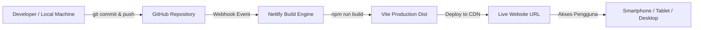

# Rencana Implementasi: Aplikasi Evaluasi Pemerintahan Digital (PermenPANRB No. 8 Tahun 2026)

Dokumen ini berisi rencana implementasi komprehensif, arsitektur teknis, desain antarmuka, integrasi Google Gemini AI, serta alur CI/CD ke GitHub dan Netlify.

---

## 1. Ringkasan Eksekutif & Tujuan Proyek

Aplikasi **Evaluasi Pemerintahan Digital (EVAL-PEMDI)** dirancang untuk membantu instansi pemerintah (kementerian, lembaga, pemerintah daerah) dalam memahami, mempersiapkan, dan memvalidasi indikator-indikator evaluasi pemerintahan digital berdasarkan **PermenPANRB Nomor 8 Tahun 2026**.

Aplikasi ini dilengkapi dengan:
- Katalog interaktif seluruh domain, aspek, dan indikator evaluasi.
- Rincian kriteria penilaian (Tingkat Kematangan/Level 1–5).
- Daftar dokumen bukti pendukung (*evidence*) wajib & rekomendasi untuk setiap indikator.
- Asisten Cerdas bertenaga **Google Gemini AI** untuk analisis kelayakan bukti, rekomendasi perbaikan dokumen bukti, dan tanya jawab interaktif indikator.
- Desain antarmuka modern, cerah (*bright & engaging*), serta responsif untuk ponsel (smartphone) dan tablet.
- Otomasi *Continuous Integration & Continuous Deployment* (CI/CD) ke **Netlify** setiap kali kode di-*push* ke repositori **GitHub**.

---

## 2. Arsitektur Teknologi & Pilihan Stack

| Komponen | Teknologi Terpilih | Alasan & Keunggulan |
| :--- | :--- | :--- |
| **Framework Frontend** | React 18 / 19 + Vite | Performa rendering ultra-cepat, Hot Module Replacement (HMR) instan, ukuran bundle ringan. |
| **Styling & Desain UI** | Tailwind CSS (Lebih modern & fleksibel dari Bootstrap 4) + CSS Variables | Jauh lebih modern, mobile-first responsive utility, fleksibilitas tinggi untuk warna-warna cerah (*vibrant/palette*), micro-interaction, dan dark/light mode. |
| **Ikonografi** | Lucide React | Ikon SVG modern, clean, ringan, dan ramah sentuhan layar ponsel. |
| **AI Integration** | Google Generative AI SDK (`@google/genai` / Gemini API) | Digunakan untuk analisis dokumen bukti (*evidence reviewer*), chat interaktif regulasi, dan simulator skor kematangan. |
| **State & Local Storage** | React State + LocalStorage | Memungkinkan pengguna menyimpan progres checklist bukti secara offline tanpa perlu backend database rumit di tahap awal. |
| **Hosting & CI/CD** | GitHub + Netlify | Otomasi deploy instan (*git push* trigger), SSL otomatis gratis, CDN global cepat, dan pengelolaan environment variable yang aman. |

---

## 3. Fitur Utama Aplikasi

### A. Eksplorasi Indikator & Regulasi PermenPANRB 8/2026
1. **Navigasi Berdasarkan Domain & Aspek:**
   - Domain Kebijakan Pemerintahan Digital
   - Domain Tata Kelola Pemerintahan Digital
   - Domain Manajemen Pemerintahan Digital
   - Domain Layanan Pemerintahan Digital
2. **Detail Indikator Komprehensif:**
   - Penjelasan definisi indikator & tujuan evaluasi.
   - Matriks kriteria Level Kematangan (Level 1: Rintisan s.d. Level 5: Optimum).
   - Narasi eksplisit daftar **Dokumen Bukti (*Data Dukung/Evidence*)** yang dipersyaratkan.
3. **Pencarian Cepat & Filter:**
   - Fitur live-search berdasarkan nama indikator, nomor, kata kunci dokumen (misal: "SK Tim", "SOP", "Arsitektur SPBE").
   - Filter berdasarkan Domain, Aspek, dan Status kelengkapan bukti.

### B. Checklist & Self-Assessment Dokumen Bukti
1. **Interactive Evidence Tracker:**
   - Pengguna dapat mencentang dokumen bukti yang sudah dimiliki vs belum dimiliki.
   - Status kelengkapan per indikator (Belum Lengkap, Sebagian, Siap Evaluasi).
   - Ringkasan statistik kepatuhan dalam bentuk progress bar dan grafik persentase kesiapan.
2. **Catatan Mandiri (*Notes & Link*):**
   - Kolom untuk menempelkan tautan dokumen bukti (Google Drive/Cloud Storage) atau catatan perbaikan per indikator.

### C. Asisten AI Pintar (Google Gemini API)
1. **Konsultasi Regulasi & Bukti Dukung:**
   - Pengguna dapat bertanya: *"Apa saja syarat dokumen bukti untuk Indikator Layanan Kepegawaian agar bisa mencapai Level 4?"*
   - Gemini menjawab dengan rujukan ketentuan PermenPANRB No. 8/2026.
2. **Reviewer Kelayakan Dokumen Bukti:**
   - Pengguna memasukkan deskripsi atau ringkasan isi dokumen yang mereka miliki.
   - Gemini menganalisis apakah dokumen tersebut memenuhi standar kriteria atau masih memerlukan dokumen pelengkap (seperti bukti sosialisasi, notula, atau SK pengesahan).

### D. User Experience (UX) Mobile & Tablet
1. **Desain Mobile-First:**
   - Bottom Navigation Bar atau Slide-over Drawer untuk kemudahan akses jempol pada layar smartphone.
   - Card-based layout yang nyaman dibaca dan tidak sesak pada tablet maupun ponsel.
2. **Palet Warna Cerah & Menarik (*Bright & Engaging*):**
   - Warna Primer: *Vibrant Azure Blue* (`#2563eb`) & *Emerald Teal* (`#059669`) untuk kesan profesional sekaligus segar.
   - Warna Aksen: *Sunshine Yellow / Amber* (`#f59e0b`) & *Purple Accent* (`#8b5cf6`) untuk status, badges, dan AI highlight.
   - Kontras teks tinggi (WCAG compliant) untuk keterbacaan optimal di luar ruangan.

---

## 4. Struktur Direktori Proyek

```plaintext
EVAL_PEMDI/
├── .github/
│   └── workflows/              # Opsi GitHub Actions (jika diperlukan custom CI)
├── public/
│   ├── favicon.ico
│   └── manifest.json           # PWA ready untuk smartphone
├── src/
│   ├── assets/                 # Logo, ikon ilustrasi
│   ├── components/
│   │   ├── common/             # Button, Badge, Modal, Card, Input
│   │   ├── layout/             # Navbar, MobileNav, Footer, Sidebar
│   │   ├── indicators/         # IndicatorList, IndicatorCard, IndicatorDetailModal
│   │   ├── checklist/          # EvidenceChecklist, ProgressTracker
│   │   └── ai/                 # GeminiChatWidget, EvidenceReviewerModal
│   ├── data/
│   │   ├── domainsData.js      # Definisi Domain & Aspek
│   │   └── indicatorsData.js   # Dataset lengkap seluruh indikator & narasi dokumen bukti
│   ├── services/
│   │   └── geminiService.js    # Konfigurasi & integrasi API Google Gemini
│   ├── hooks/
│   │   ├── useChecklist.js     # State persistence data checklist ke LocalStorage
│   │   └── useGeminiChat.js    # Hook komunikasi asisten AI
│   ├── utils/
│   │   └── exportUtils.js      # Ekspor ringkasan kesiapan (PDF / Excel / JSON)
│   ├── App.jsx                 # Halaman utama aplikasi
│   ├── main.jsx                # Entry point React
│   └── index.css               # Setup Tailwind CSS & custom animations
├── .env.example                # Template variabel lingkungan
├── .gitignore
├── netlify.toml                # Konfigurasi build dan rewrite URL Netlify
├── package.json
├── postcss.config.js
├── tailwind.config.js
├── vite.config.js
└── planning1.md                # Dokumen perencanaan ini
```

---

## 5. Integrasi Google Gemini API

### A. Konfigurasi Kunci API
API Key dikonfigurasi melalui Environment Variable:
```env
VITE_GEMINI_API_KEY=your_gemini_api_key_here
```
> **Catatan Keamanan & Praktik Terbaik:**
> - Kunci API disimpan dalam file `.env` untuk lokal development.
> - Di Netlify, kunci diset pada menu **Site Configuration > Environment Variables**.
> - Kode di frontend memanggil SDK Gemini dengan `import.meta.env.VITE_GEMINI_API_KEY`.

### B. Prompt Engineering Khusus Regulasi
Sistem prompt disetel sebagai **Konsultan Ahli Evaluasi Pemerintahan Digital (PermenPANRB No. 8 Tahun 2026)**:
- Memberikan penjelasan berdasar regulasi dengan gaya bahasa formal, santun, dan aplikatif.
- Secara ketat memisahkan antara dokumen kebijakan (SK, Perbup/Perwal/Permen), dokumen tata kelola (SOP, Pedoman), dokumen pelaksanaan (notula, dokumentasi, tangkapan layar sistem), dan dokumen evaluasi berkala.

---

## 6. Alur Deployment Otomatis (GitHub ke Netlify)



### File `netlify.toml`
Untuk memastikan Single Page Application (SPA) dan routing berjalan lancar tanpa error 404:
```toml
[build]
  command = "npm run build"
  publish = "dist"

[build.environment]
  NODE_VERSION = "20"

[[redirects]]
  from = "/*"
  to = "/index.html"
  status = 200
```

---

## 7. Tahapan Pelaksanaan (Action Plan)

| Fase | Tahapan Aktivitas | Output / Deliverable |
| :---: | :--- | :--- |
| **Fase 1** | **Inisialisasi & Setup Lingkungan Proyek**<br>• Setup React + Vite + Tailwind CSS.<br>• Konfigurasi Lucide icons & color tokens cerah.<br>• Setup `netlify.toml` dan repository Git. | Proyek skeleton siap jalan di lokal dan siap deploy. |
| **Fase 2** | **Penyusunan Dataset Indikator & Bukti Dukung**<br>• Input data Domain, Aspek, dan Indikator PermenPANRB 8/2026.<br>• Struktur narasi dokumen bukti (SK, SOP, Laporan, Arsitektur).<br>• Format data JSON yang mudah difilter dan dicari. | `src/data/indicatorsData.js` terstruktur rapi. |
| **Fase 3** | **Pengembangan Antarmuka (Mobile & Tablet First)**<br>• Header cerah & filter interaktif.<br>• Kartu indikator dengan status level kematangan.<br>• Modal detail dokumen bukti & checklist progres.<br>• Bottom navigation / quick bar untuk perangkat mobile. | UI responsif, interaktif, dan ramah sentuhan. |
| **Fase 4** | **Integrasi Google Gemini AI**<br>• Implementasi `geminiService.js`.<br>• Floating Chat Widget untuk tanya jawab indikator.<br>• Fitur "Cek Dokumen Bukti Saya" dengan evaluasi otomatis dari AI. | Fitur AI aktif & responsif memberikan saran bukti. |
| **Fase 5** | **Pengujian & CI/CD Deployment**<br>• Testing di berbagai ukuran layar (Ponsel, Tablet, Layar PC).<br>• Push repositori ke GitHub.<br>• Hubungkan repositori ke Netlify & set environment variables.<br>• Uji coba build dan auto-deploy. | Aplikasi live di domain Netlify. |

---

## 8. Verifikasi & Pengujian Kualitas

1. **Responsiveness Test:** Uji tampilan pada resolusi iPhone SE, Samsung Galaxy, iPad, iPad Pro, serta Laptop.
2. **Pencarian & Filter:** Uji kecepatan filtering indikator tanpa lag.
3. **AI Accuracy Test:** Uji prompt pertanyaan seputar dokumen bukti Level 1 sampai Level 5.
4. **Offline Persistence:** Uji checklist dokumen tersimpan ketika halaman di-refresh.
5. **Netlify Build Verification:** Memastikan build lolos tanpa error ESLint atau environment variable missing.
