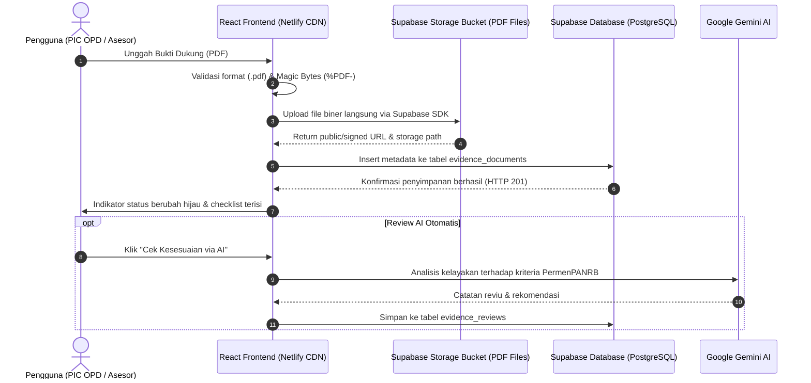

# Rencana Implementasi Migrasi: MySQL ke Cloud Database Supabase
## Aplikasi Evaluasi Kinerja Pemerintahan Digital (PermenPANRB No. 8 Tahun 2026)
**Dokumen Referensi Teknis**: `supadatabase.md`  
**Platform Target**: **Supabase Cloud (PostgreSQL 15/16 + Supabase Storage + Row Level Security)**  
**Versi Dokumen**: 1.0  
**Tanggal**: September 2026  

---

## 1. Latar Belakang & Alasan Migrasi ke Supabase

Saat ini, basis data **EvalPemdi** berjalan di server lokal (MySQL 8.4 via Laragon di `localhost:3306`). Untuk aplikasi yang di-*deploy* ke cloud (**Netlify**) dan diakses oleh banyak OPD/instansi, arsitektur lokal memiliki keterbatasan fundamental:
1. **Aksesibilitas Cloud**: Netlify Functions yang berjalan di cloud tidak dapat mengakses database di laptop/PC lokal (`localhost`) tanpa konfigurasi IP publik/VPN/tunneling yang rentan dan tidak stabil.
2. **Penyimpanan Berkas PDF Terdistribusi**: Serverless functions pada Netlify bersifat *ephemeral* (tidak memiliki disk lokal permanen). Folder lokal `public/uploads/` tidak persisten setelah instance function dimatikan.
3. **Solusi Terbaik: Supabase Cloud**:
   - **PostgreSQL Database**: Database relasional tangguh kelas enterprise berbasis cloud dengan koneksi SSL aman.
   - **Supabase Storage**: Object storage terintegrasi (berbasis S3) dengan CDN global berkecepatan tinggi khusus untuk berkas PDF bukti dukung.
   - **Row Level Security (RLS)**: Proteksi data tingkat baris langsung di tingkat basis data.
   - **SDK JavaScript Ringan (`@supabase/supabase-js`)**: Dapat dipanggil langsung dari frontend React atau dari Netlify Functions tanpa perlu konfigurasi server manual.

---

## 2. Perbandingan Arsitektur: MySQL Lokal vs Supabase Cloud

| Komponen | Arsitektur Saat Ini (MySQL Lokal) | Arsitektur Target (Supabase Cloud) |
| :--- | :--- | :--- |
| **Database Engine** | MySQL 8.4 LTS (Localhost) | Managed PostgreSQL 15/16 (Global Cloud AWS) |
| **Konektivitas** | Hanya bisa diakses dari perangkat lokal | REST API, GraphQL, & Direct SSL Connection dari mana saja |
| **Penyimpanan PDF** | Local Disk (`public/uploads/evidence/`) | **Supabase Storage Bucket** (`eval-pemdi-evidence`) dengan CDN |
| **Keamanan Akses** | User root & password blank | API Key terenkripsi (Anon Key + Service Role Key) & RLS |
| **Kompatibilitas Netlify** | Memerlukan tunnel khusus | **100% Native & Cloud-Ready** |
| **Biaya & Skalabilitas** | Terbatas pada kapasitas laptop | Free Tier luas (Database 500MB, Storage 1GB, Transfer 2GB/bulan) |

---

## 3. Diagram Alur Arsitektur Baru dengan Supabase



---

## 4. Skema Basis Data PostgreSQL Supabase (DDL Lengkap Siap Eksekusi)

Skrip SQL DDL berikut dirancang khusus untuk dieksekusi di **SQL Editor Supabase**:

```sql
-- ============================================================================
-- SKRIP BASIS DATA EVALUASI PEMERINTAHAN DIGITAL (PERMENPANRB NO. 8 TAHUN 2026)
-- Target: Supabase Cloud Database (PostgreSQL 15/16)
-- ============================================================================

-- Aktifkan ekstensi UUID dan Kriptografi
CREATE EXTENSION IF NOT EXISTS "uuid-ossp";
CREATE EXTENSION IF NOT EXISTS "pgcrypto";

-- ----------------------------------------------------------------------------
-- 1. TABEL INSTANSI (Kementerian, Lembaga, atau Pemda)
-- ----------------------------------------------------------------------------
CREATE TABLE IF NOT EXISTS instansi (
    id UUID PRIMARY KEY DEFAULT gen_random_uuid(),
    kode_instansi VARCHAR(50) UNIQUE NOT NULL,
    nama_instansi VARCHAR(255) NOT NULL,
    kategori VARCHAR(50) NOT NULL CHECK (kategori IN ('Kementerian', 'Lembaga', 'Pemprov', 'Pemkab', 'Pemkot')),
    alamat_kantor TEXT,
    logo_url TEXT,
    created_at TIMESTAMPTZ DEFAULT NOW(),
    updated_at TIMESTAMPTZ DEFAULT NOW()
);

-- ----------------------------------------------------------------------------
-- 2. TABEL UNIT KERJA / OPD
-- ----------------------------------------------------------------------------
CREATE TABLE IF NOT EXISTS unit_kerja (
    id UUID PRIMARY KEY DEFAULT gen_random_uuid(),
    instansi_id UUID NOT NULL REFERENCES instansi(id) ON DELETE CASCADE,
    nama_unit VARCHAR(255) NOT NULL,
    singkatan VARCHAR(50),
    created_at TIMESTAMPTZ DEFAULT NOW()
);

-- ----------------------------------------------------------------------------
-- 3. TABEL USERS (Akses & PIC Indikator)
-- ----------------------------------------------------------------------------
CREATE TABLE IF NOT EXISTS users (
    id UUID PRIMARY KEY DEFAULT gen_random_uuid(),
    instansi_id UUID REFERENCES instansi(id) ON DELETE SET NULL,
    unit_kerja_id UUID REFERENCES unit_kerja(id) ON DELETE SET NULL,
    nama_lengkap VARCHAR(150) NOT NULL,
    email VARCHAR(150) UNIQUE NOT NULL,
    password_hash TEXT,
    role VARCHAR(50) NOT NULL DEFAULT 'pic_opd' CHECK (role IN ('admin_instansi', 'pic_opd', 'asesor_internal', 'viewer')),
    telepon_wa VARCHAR(30),
    is_active BOOLEAN DEFAULT TRUE,
    created_at TIMESTAMPTZ DEFAULT NOW(),
    updated_at TIMESTAMPTZ DEFAULT NOW()
);

-- ----------------------------------------------------------------------------
-- 4. TABEL PERIODE EVALUASI
-- ----------------------------------------------------------------------------
CREATE TABLE IF NOT EXISTS evaluation_periods (
    id UUID PRIMARY KEY DEFAULT gen_random_uuid(),
    tahun INT NOT NULL UNIQUE,
    nama_periode VARCHAR(100) NOT NULL,
    tanggal_mulai DATE,
    tanggal_selesai DATE,
    is_active BOOLEAN DEFAULT TRUE,
    created_at TIMESTAMPTZ DEFAULT NOW()
);

-- ----------------------------------------------------------------------------
-- 5. TABEL MASTER INDIKATOR (20 Indikator PermenPANRB 8/2026)
-- ----------------------------------------------------------------------------
CREATE TABLE IF NOT EXISTS indicators (
    id VARCHAR(10) PRIMARY KEY, -- 'ind-01', 'ind-02', dst.
    nomor INT NOT NULL UNIQUE,
    kode VARCHAR(20) NOT NULL UNIQUE,
    nama VARCHAR(255) NOT NULL,
    domain_id VARCHAR(20) NOT NULL,
    domain_name VARCHAR(100) NOT NULL,
    aspect_name VARCHAR(100) NOT NULL,
    bobot DECIMAL(5,2) DEFAULT 5.00 NOT NULL,
    deskripsi TEXT,
    tips_asesor TEXT,
    created_at TIMESTAMPTZ DEFAULT NOW()
);

-- ----------------------------------------------------------------------------
-- 6. TABEL KRITERIA LEVEL INDIKATOR (Level 1 s.d. 5)
-- ----------------------------------------------------------------------------
CREATE TABLE IF NOT EXISTS indicator_levels (
    id UUID PRIMARY KEY DEFAULT gen_random_uuid(),
    indicator_id VARCHAR(10) NOT NULL REFERENCES indicators(id) ON DELETE CASCADE,
    level INT NOT NULL CHECK (level BETWEEN 1 AND 5),
    kriteria TEXT NOT NULL,
    narasi_bukti TEXT NOT NULL,
    CONSTRAINT uq_indicator_level UNIQUE(indicator_id, level)
);

-- ----------------------------------------------------------------------------
-- 7. TABEL BUTIR CHECKLIST BUKTI
-- ----------------------------------------------------------------------------
CREATE TABLE IF NOT EXISTS indicator_checklists (
    id VARCHAR(30) PRIMARY KEY, -- 'c1-1', 'c1-2'
    indicator_id VARCHAR(10) NOT NULL REFERENCES indicators(id) ON DELETE CASCADE,
    label TEXT NOT NULL,
    is_required BOOLEAN DEFAULT TRUE,
    min_level INT DEFAULT 3 CHECK (min_level BETWEEN 1 AND 5),
    urutan INT DEFAULT 1,
    created_at TIMESTAMPTZ DEFAULT NOW()
);

-- ----------------------------------------------------------------------------
-- 8. TABEL PENILAIAN MANDIRI (SELF ASSESSMENT)
-- ----------------------------------------------------------------------------
CREATE TABLE IF NOT EXISTS self_assessments (
    id UUID PRIMARY KEY DEFAULT gen_random_uuid(),
    instansi_id UUID NOT NULL REFERENCES instansi(id) ON DELETE CASCADE,
    periode_id UUID NOT NULL REFERENCES evaluation_periods(id) ON DELETE CASCADE,
    indicator_id VARCHAR(10) NOT NULL REFERENCES indicators(id) ON DELETE CASCADE,
    self_level INT NOT NULL DEFAULT 1 CHECK (self_level BETWEEN 1 AND 5),
    weighted_score DECIMAL(6,3) GENERATED ALWAYS AS (self_level * 5.0) STORED,
    catatan_internal TEXT,
    status_kesiapan VARCHAR(50) DEFAULT 'belum_lengkap' CHECK (status_kesiapan IN ('belum_lengkap', 'sebagian', 'siap_evaluasi')),
    updated_by UUID REFERENCES users(id) ON DELETE SET NULL,
    updated_at TIMESTAMPTZ DEFAULT NOW(),
    CONSTRAINT uq_instansi_periode_indicator UNIQUE(instansi_id, periode_id, indicator_id)
);

-- ----------------------------------------------------------------------------
-- 9. TABEL DOKUMEN BUKTI DUKUNG (EVIDENCE DOCUMENTS)
-- ----------------------------------------------------------------------------
CREATE TABLE IF NOT EXISTS evidence_documents (
    id UUID PRIMARY KEY DEFAULT gen_random_uuid(),
    instansi_id UUID NOT NULL REFERENCES instansi(id) ON DELETE CASCADE,
    periode_id UUID NOT NULL REFERENCES evaluation_periods(id) ON DELETE CASCADE,
    indicator_id VARCHAR(10) NOT NULL REFERENCES indicators(id) ON DELETE CASCADE,
    checklist_id VARCHAR(30) REFERENCES indicator_checklists(id) ON DELETE SET NULL,
    target_level INT NOT NULL CHECK (target_level BETWEEN 1 AND 5),
    jenis_sumber VARCHAR(30) NOT NULL CHECK (jenis_sumber IN ('file_upload', 'cloud_link', 'screenshot')),
    judul_dokumen VARCHAR(255) NOT NULL,
    nomor_surat_resmi VARCHAR(100),
    tahun_terbit INT,
    deskripsi_singkat TEXT,
    file_name_original VARCHAR(255),
    file_name_system VARCHAR(255),
    file_path_storage TEXT, -- Path di Supabase Storage
    file_mime_type VARCHAR(100) DEFAULT 'application/pdf',
    file_size_bytes BIGINT,
    file_hash_sha256 VARCHAR(64),
    external_url TEXT,      -- Public URL Supabase Storage
    status_validasi VARCHAR(30) DEFAULT 'draft' CHECK (status_validasi IN ('draft', 'diajukan', 'memenuhi', 'perlu_revisi', 'ditolak')),
    uploaded_by UUID NOT NULL REFERENCES users(id) ON DELETE RESTRICT,
    created_at TIMESTAMPTZ DEFAULT NOW(),
    updated_at TIMESTAMPTZ DEFAULT NOW()
);

-- ----------------------------------------------------------------------------
-- 10. TABEL CATATAN REVIU BUKTI DUKUNG (ASESOR & AI GEMINI)
-- ----------------------------------------------------------------------------
CREATE TABLE IF NOT EXISTS evidence_reviews (
    id UUID PRIMARY KEY DEFAULT gen_random_uuid(),
    evidence_id UUID NOT NULL REFERENCES evidence_documents(id) ON DELETE CASCADE,
    reviewer_id UUID REFERENCES users(id) ON DELETE SET NULL,
    tipe_reviewer VARCHAR(30) NOT NULL CHECK (tipe_reviewer IN ('asesor_manusia', 'gemini_ai')),
    status_hasil VARCHAR(30) NOT NULL CHECK (status_hasil IN ('layak', 'kurang_lengkap', 'tidak_sesuai')),
    skor_relevansi INT CHECK (skor_relevansi BETWEEN 0 AND 100),
    catatan_reviu TEXT NOT NULL,
    rekomendasi_perbaikan TEXT,
    created_at TIMESTAMPTZ DEFAULT NOW()
);

-- ----------------------------------------------------------------------------
-- 11. TABEL AUDIT LOG (JEJAK AKTIVITAS)
-- ----------------------------------------------------------------------------
CREATE TABLE IF NOT EXISTS audit_logs (
    id UUID PRIMARY KEY DEFAULT gen_random_uuid(),
    user_id UUID REFERENCES users(id) ON DELETE SET NULL,
    aksi VARCHAR(50) NOT NULL,
    entitas VARCHAR(50) NOT NULL,
    entitas_id UUID,
    data_lama JSONB,
    data_baru JSONB,
    ip_address VARCHAR(45),
    user_agent TEXT,
    created_at TIMESTAMPTZ DEFAULT NOW()
);

-- ============================================================================
-- INDEKS PERFORMA
-- ============================================================================
CREATE INDEX IF NOT EXISTS idx_evidence_instansi_indicator ON evidence_documents(instansi_id, indicator_id);
CREATE INDEX IF NOT EXISTS idx_evidence_status ON evidence_documents(status_validasi);
CREATE INDEX IF NOT EXISTS idx_evidence_checklist ON evidence_documents(checklist_id);
CREATE INDEX IF NOT EXISTS idx_self_assessments_lookup ON self_assessments(instansi_id, periode_id, indicator_id);
CREATE INDEX IF NOT EXISTS idx_indicator_checklists_ind ON indicator_checklists(indicator_id);
CREATE INDEX IF NOT EXISTS idx_audit_logs_user_date ON audit_logs(user_id, created_at DESC);

-- ============================================================================
-- TRIGGER UPDATE TIMESTAMP OTOMATIS
-- ============================================================================
CREATE OR REPLACE FUNCTION set_updated_at_column()
RETURNS TRIGGER AS $$
BEGIN
  NEW.updated_at = NOW();
  RETURN NEW;
END;
$$ LANGUAGE plpgsql;

CREATE OR REPLACE TRIGGER trg_evidence_updated_at
BEFORE UPDATE ON evidence_documents
FOR EACH ROW EXECUTE FUNCTION set_updated_at_column();

CREATE OR REPLACE TRIGGER trg_assessment_updated_at
BEFORE UPDATE ON self_assessments
FOR EACH ROW EXECUTE FUNCTION set_updated_at_column();

-- ============================================================================
-- ROW LEVEL SECURITY (RLS) POLICIES
-- ============================================================================
ALTER TABLE indicators ENABLE ROW LEVEL SECURITY;
ALTER TABLE indicator_levels ENABLE ROW LEVEL SECURITY;
ALTER TABLE indicator_checklists ENABLE ROW LEVEL SECURITY;
ALTER TABLE evidence_documents ENABLE ROW LEVEL SECURITY;
ALTER TABLE self_assessments ENABLE ROW LEVEL SECURITY;

-- Kebijakan Akses Baca Publik untuk Katalog Indikator
CREATE POLICY "Public Read Indicators" ON indicators FOR SELECT USING (true);
CREATE POLICY "Public Read Indicator Levels" ON indicator_levels FOR SELECT USING (true);
CREATE POLICY "Public Read Indicator Checklists" ON indicator_checklists FOR SELECT USING (true);

-- Kebijakan Akses Bukti Dukung (Semua pengguna aktif dapat membaca dan mengunggah)
CREATE POLICY "Enable Read Access for All Evidence" ON evidence_documents FOR SELECT USING (true);
CREATE POLICY "Enable Insert Access for Evidence" ON evidence_documents FOR INSERT WITH CHECK (true);
CREATE POLICY "Enable Delete Access for Evidence" ON evidence_documents FOR DELETE USING (true);
```

---

## 5. Konfigurasi Supabase Storage (Object Storage untuk Berkas PDF)

### 5.1. Pembuatan Bucket Berkas
Pada dashboard Supabase (**Storage** > **New Bucket**):
- **Nama Bucket**: `eval-pemdi-evidence`
- **Tipe**: *Public Bucket* (agar URL berkas bukti dapat diakses langsung oleh asesor untuk evaluasi)
- **Batas Ukuran Berkas**: `26214400` bytes (25 MB)
- **MIME Types yang Diizinkan**: `application/pdf`

### 5.2. Kebijakan Keamanan Storage (Storage Policies)
```sql
-- Kebijakan akses unduh publik untuk berkas PDF di bucket eval-pemdi-evidence
CREATE POLICY "Public Access Evidence PDF" 
ON storage.objects FOR SELECT 
USING (bucket_id = 'eval-pemdi-evidence');

-- Kebijakan unggah berkas PDF
CREATE POLICY "Allow Upload Evidence PDF" 
ON storage.objects FOR INSERT 
WITH CHECK (bucket_id = 'eval-pemdi-evidence' AND (storage.extension(name) = 'pdf'));

-- Kebijakan hapus berkas
CREATE POLICY "Allow Delete Evidence PDF" 
ON storage.objects FOR DELETE 
USING (bucket_id = 'eval-pemdi-evidence');
```

---

## 6. Langkah-Langkah Migrasi Teknis (Step-by-Step Implementation)

### Langkah 1: Buat Proyek di Supabase
1. Kunjungi [supabase.com](https://supabase.com) dan masuk dengan akun GitHub.
2. Buat proyek baru dengan nama: **`EvalPemdi`**.
3. Pilih Region terdekat: **Singapore (ap-southeast-1)** untuk latensi tercepat di Indonesia.
4. Salin kredensial API dari menu **Project Settings** > **API**:
   - **Project URL** (misal: `https://xyzprojectid.supabase.co`)
   - **Anon Public Key** (misal: `eyJhbGciOiJIUzI1NiIsInR5cCI6...`)

### Langkah 2: Eksekusi Skrip DDL & Seeding Data
1. Buka menu **SQL Editor** pada dashboard Supabase.
2. Tempelkan seluruh skrip DDL pada **Bagian 4** di atas, lalu klik tombol **Run**.
3. Tempelkan skrip *seed data* (Master 20 Indikator, 100 Level, 79 Butir Checklist, Instansi, dan Akun) dari file [`seed_data_supabase.sql`](#) dan klik **Run**.

### Langkah 3: Install SDK Supabase di Repositori Proyek
Jalankan perintah instalasi pada terminal proyek:
```bash
npm install @supabase/supabase-js
```

### Langkah 4: Konfigurasi Environment Variables
Tambahkan variabel lingkungan ke file [`.env`](file:///d:/DODI%20AGUSRI.S.KOM/2026%202026%202026/FELLOW%20DEVELOPER/React.JS/EVAL_PEMDI/.env) dan dashboard **Netlify** (Site configuration > Environment variables):

```env
# Supabase Cloud Credentials
VITE_SUPABASE_URL=https://your-project-id.supabase.co
VITE_SUPABASE_ANON_KEY=your-anon-public-key-here
```

### Langkah 5: Buat Client SDK Supabase (`src/services/supabaseClient.js`)
```javascript
import { createClient } from '@supabase/supabase-js';

const supabaseUrl = import.meta.env.VITE_SUPABASE_URL;
const supabaseAnonKey = import.meta.env.VITE_SUPABASE_ANON_KEY;

export const supabase = createClient(supabaseUrl, supabaseAnonKey);
```

### Langkah 6: Pembaruan `evidenceService.js` untuk Menggunakan Supabase
Menggantikan Netlify Functions lokal dengan Supabase Storage + Database client:
1. **Upload File**: Mengunggah berkas biner PDF langsung ke bucket `eval-pemdi-evidence` melalui `supabase.storage.from('eval-pemdi-evidence').upload(...)`.
2. **Simpan Metadata**: Menyimpan informasi dokumen ke tabel `evidence_documents` melalui `supabase.from('evidence_documents').insert(...)`.
3. **List Bukti**: Mengambil data melalui `supabase.from('evidence_documents').select('*').eq('indicator_id', indicatorId)`.
4. **Hapus Bukti**: Menghapus file fisik dari storage dan menghapus record di database.

---

## 7. Rencana Verifikasi & Pengujian Pasca-Migrasi

| No | Komponen Pengujian | Kriteria Keberhasilan |
| :---: | :--- | :--- |
| 1 | **Koneksi Database Supabase** | Frontend berhasil membaca 20 indikator dari tabel `indicators` di Supabase. |
| 2 | **Validasi PDF & Magic Bytes** | File selain `.pdf` ditolak sebelum proses upload dimulai. |
| 3 | **Upload File ke Supabase Storage** | File PDF tersimpan di bucket `eval-pemdi-evidence` dan memiliki URL publik aktif. |
| 4 | **Penyimpanan Metadata SQL** | Baris baru tercatat di tabel `evidence_documents` dengan `external_url` mengarah ke Supabase Storage. |
| 5 | **Pratinjau & Unduh Dokumen** | Klik ikon mata (*Eye*) di UI membuka dokumen PDF langsung dari CDN Supabase. |
| 6 | **Penghapusan Bukti** | Klik tombol tempat sampah menghapus file dari storage bucket dan baris dari tabel SQL. |
| 7 | **Deploy ke Netlify** | Aplikasi berjalan di production Netlify tanpa ketergantungan MySQL lokal di laptop. |

---

## 8. Ringkasan File Rujukan
- Dokumen Rencana: [`supadatabase.md`](file:///d:/DODI%20AGUSRI.S.KOM/2026%202026%202026/FELLOW%20DEVELOPER/React.JS/EVAL_PEMDI/supadatabase.md)
- Skema DDL PostgreSQL: Siap disalin dari Bagian 4 dokumen ini ke SQL Editor Supabase.
- Konfigurasi Client: `src/services/supabaseClient.js` (akan dibuat pada tahap eksekusi).
